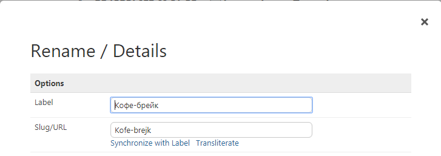

# [URL Translit](https://github.com/mahotilo/URLTranslit) - URL Translit plugin for Typesetter CMS

## About
URL Translit adds link to page properies that allows current page URL transliteration 

## See also 
* [Typesetter Home](http://www.typesettercms.com)
* [Typesetter on GitHub](https://github.com/Typesetter/Typesetter)

## Requirements
* Typesetter CMS

## Manual Installation
1. Download the [master ZIP archive](https://github.com/mahotilo/URLTranslit/archive/master.zip)
2. Upload the extracted folder 'URLTranslit-master' to your server into the /addons directory
3. Install using Typesetter's Admin Toolbox &rarr; Plugins &rarr; Manage &rarr; Available &rarr; URLTranslit

## Demo
### Rename / Details dialog

## License
GPL 2.

List of char transliteration pairs based on [transliterate by Sindre Sorhus](https://github.com/sindresorhus/transliterate)

## Version history
1.0
	- initial release
